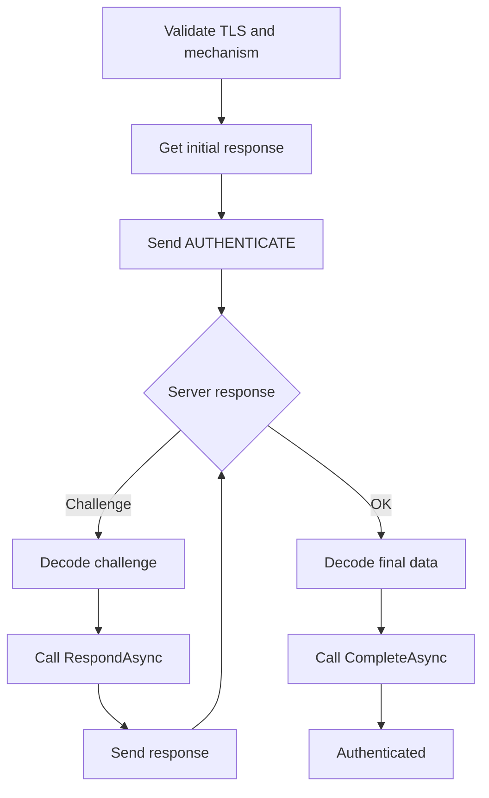
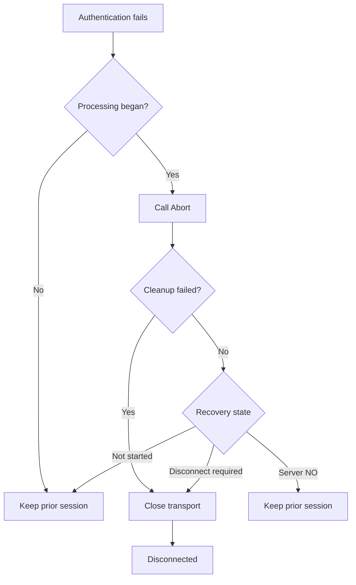
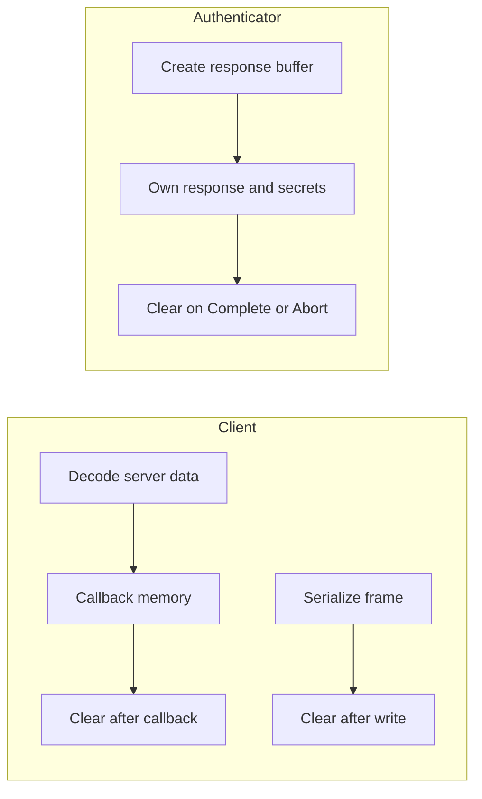

# Authentication

This guide is the canonical contract for SASL authentication in `Transiever.ManageSieve`.
It describes the checks before an exchange, authenticator callbacks, session outcomes, memory ownership, and safe diagnostics.

## Before authentication

`AuthenticateAsync` first validates the current client state, the authenticator, and the transport policy.
Authenticators require protected transport by default because `AllowsUnprotectedConnection` defaults to `false`.
`ManageSievePlainAuthenticator` keeps that default and refuses to send credentials on an unprotected connection.
An authenticator may opt in to an unprotected connection only by explicitly setting `AllowsUnprotectedConnection`.

The selected mechanism must be in the server's advertised capabilities before `GetInitialResponseAsync` is invoked or `AUTHENTICATE` is written.
After `STARTTLS`, the capabilities read over the protected transport are authoritative; a mechanism advertised only before TLS is not sufficient.
Failed preconditions produce no authenticator callback and no authentication wire output.

## Exchange lifecycle

After the checks, `ManageSieveAuthenticationExchange` asks for an optional initial response.
`null` means that the `AUTHENTICATE` command has no initial-response argument.
An empty memory value is present but encodes as an explicitly empty response, while non-empty bytes are Base64-encoded and sent as the argument.

The exchange reads the server's continuation responses through the streaming parser.
Each challenge must contain exactly one string value containing valid Base64; the decoded challenge is passed to `RespondAsync` for the duration of that callback.
The returned response remains authenticator-owned, is Base64-encoded by the client, and is written as the next exchange response.
The exchange repeats this challenge cycle until a terminal response.

The server can carry final data in either of two forms.
A mechanism may receive its final server data as the last challenge and return an empty response; in that form `CompleteAsync` receives `null`.
Alternatively, `OK (SASL ...)` carries exactly one quoted-string or literal argument, which is Base64-decoded and passed to `CompleteAsync`.
No SASL response code, or a non-SASL response code, also supplies `null`.
Decoded empty data is distinct from absent data.
`CompleteAsync` is called exactly once after `OK` and must succeed before the client enters `Authenticated`.

An unsuccessful attempt after authenticator processing begins calls `Abort` exactly once.
`Abort` is synchronous local cleanup and never sends a wire-level SASL cancellation response.
Precondition failures before authenticator processing do not call `Abort`.

## Connection outcomes

The client preserves a synchronized session only when no authentication bytes were initiated or a terminal `NO` was parsed.
Cancellation while waiting for the command lock, or before the first authentication write, preserves the current connected or secured session and propagates caller cancellation.
If authenticator processing began but no first write was initiated, `Abort` runs and the pre-wire session remains reusable unless cleanup fails.

A terminal server `NO` is synchronized rejection.
The client calls `Abort`, preserves the pre-authentication `Connected` or `Secured` state, and raises `ManageSieveAuthenticationException`.
The exception's `ResponseCode` contains only the response-code atom, such as `AUTHENTICATIONFAILED`.

`BYE`, partial writes, transport I/O failures, cancellation after transmission, operation timeout, malformed challenge or success data, and authenticator response or completion failures make the exchange indeterminate.
The client calls `Abort`, resets and disposes the transport, clears capabilities, and enters `Disconnected`.
The original caller cancellation is preserved; a linked operation timeout becomes `ManageSieve authentication timed out.`
Protocol failures and authenticator failures retain their safe typed categories.

If `Abort` throws, or transport cleanup fails, the client still closes the transport and reports the fixed `ManageSieve authentication cleanup failed.` diagnostic.
The client never attempts wire-level recovery after a local failure.

## Memory ownership

The client owns decoded challenge arrays and decoded `OK (SASL ...)` data.
Those buffers are valid only during `RespondAsync` or `CompleteAsync` and are cleared after the callback returns, including when it throws.
The client also owns encoded `AUTHENTICATE` and challenge-response frames and clears each frame after its awaited write completes.

Buffers returned by `GetInitialResponseAsync` or `RespondAsync` remain authenticator-owned; the client does not mutate them.
They must remain valid until `CompleteAsync` or `Abort`, when the authenticator clears its retained mutable response and secret buffers.
Callback memory remains client-owned, so an authenticator must not retain challenge or server-final data after the callback.

Clearing is best effort within managed code.
It cannot guarantee erasure from immutable input strings, garbage-collector or runtime copies, framework, operating-system, or transport buffers, captured wire copies, or server memory.

## Diagnostic guarantees

Authentication diagnostics are fixed and redacted.
They do not include server prose, callback exception text, credentials, encoded or decoded SASL data, or raw frames.
Applicable fixed messages include `The selected SASL mechanism requires a protected connection.`,
`The server did not advertise the selected SASL mechanism.`,
`ManageSieve authentication failed.`,
`ManageSieve authenticator failed.`,
`ManageSieve authentication cleanup failed.`,
`ManageSieve server closed the connection during authentication.`,
and `ManageSieve authentication timed out.`

For a server `NO`, `ManageSieveAuthenticationException.ResponseCode` contains only the case-insensitive response-code atom and never its arguments or prose.

## Related documentation

See the [architecture guide](architecture.md) for parser, session, transport, and component-boundary details.
See the [testing guide](testing.md) for offline conformance coverage and live-provider test policy.
