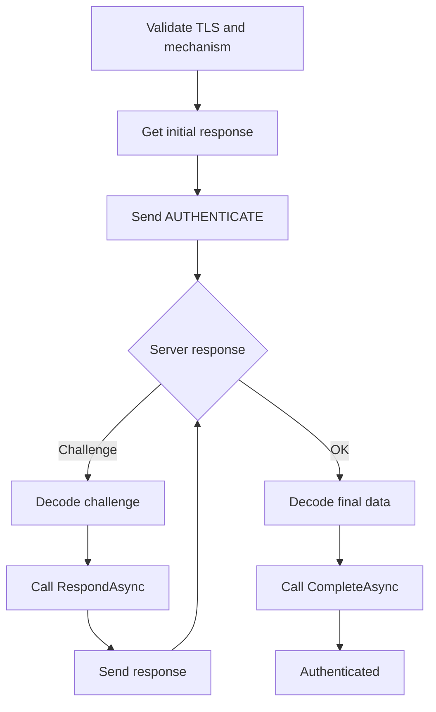
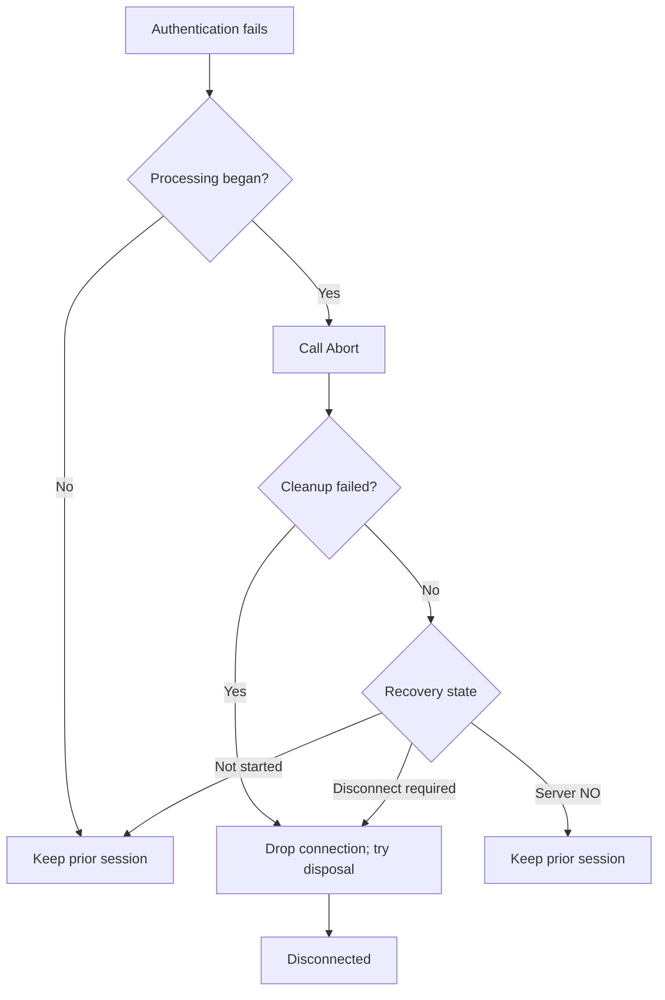
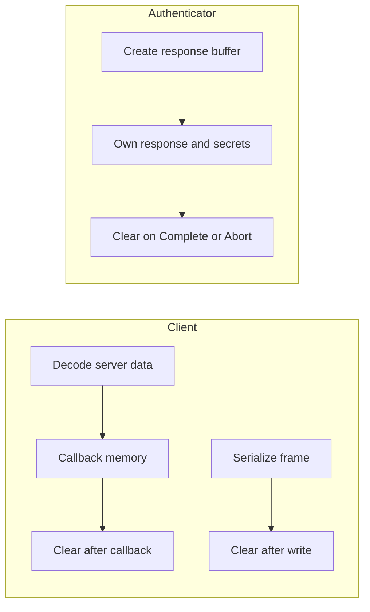

# Authentication

This guide is the canonical contract for SASL authentication in `Transiever.ManageSieve`.
It describes the checks before an exchange, authenticator callbacks, session outcomes, memory ownership, and safe diagnostics.
The ManageSieve protocol is defined by [RFC 5804](https://www.rfc-editor.org/rfc/rfc5804),
and its authentication exchange uses the [SASL framework](https://www.rfc-editor.org/rfc/rfc4422).

## Why choose a mechanism?

SASL mechanisms define how a client proves its identity to the server.
`PLAIN` sends the authorization identity, authentication identity, and password as a Base64-encoded response; Base64 is not encryption, so this client requires protected transport before using it.
`SCRAM-SHA-256` proves knowledge of the password through a salted challenge-response exchange instead of sending the password itself.
It also allows a server to store salted verification material that is not by itself sufficient to impersonate the client, reducing the impact of a credential-database disclosure.
It is specified by [RFC 5802](https://www.rfc-editor.org/rfc/rfc5802) and the SHA-256 registration in [RFC 7677](https://www.rfc-editor.org/rfc/rfc7677).
`SCRAM-SHA-256-PLUS` adds channel binding so the proof is tied to the TLS connection and its peer certificate.
This implementation uses the `tls-server-end-point` binding from [RFC 5929](https://www.rfc-editor.org/rfc/rfc5929), while [RFC 9266](https://www.rfc-editor.org/rfc/rfc9266) defines the `tls-exporter` binding for newer TLS versions.
Both SCRAM mechanisms require protected transport; PLUS additionally requires a supported TLS 1.2 endpoint binding.
`OAUTHBEARER` is for a caller that already has an access token and wants the server to validate it.
It does not acquire or refresh a token, and it is not a replacement for provider-specific OAuth or OpenID Connect policy.
`EXTERNAL` uses an identity established by a TLS client certificate, for services that map certificates to accounts.
The SASL exchange asks the server to authorize that identity; advertising EXTERNAL does not prove that a certificate was presented or that the server will accept it.

## Before authentication

`AuthenticateAsync` first validates the current client state, the authenticator, and the transport policy.
Authenticators require protected transport by default because `AllowsUnprotectedConnection` defaults to `false`.
`ManageSievePlainAuthenticator` keeps that default and refuses to send credentials on an unprotected connection.
An authenticator may opt in to an unprotected connection only by explicitly setting `AllowsUnprotectedConnection`.

The selected mechanism must be in the server's advertised capabilities before `GetInitialResponseAsync` is invoked or `AUTHENTICATE` is written.
After `STARTTLS`, the capabilities read over the protected transport are authoritative; a mechanism advertised only before TLS is not sufficient.
`CanUseScramSha256Plus` is false before TLS, when PLUS is not advertised, for TLS 1.3, or when the endpoint binding is unavailable or unsupported.
During `AuthenticateAsync`, the client rechecks the binding under the command lock, fetches it immediately before `GetInitialResponseAsync`, and clears the attempt-owned bytes after the exchange; it does not cache a binding beyond the attempt.
Failed preconditions produce no authenticator callback and no authentication wire output.
Authenticators with `RequiresClientCertificate` set to `true` additionally require a configured certificate with a usable private key and negotiated mutual TLS with a selected local certificate.
This capability defaults to `false` for existing authenticators.
These checks run before callbacks, authentication writes, and acquisition of the command lock.

## SCRAM-SHA-256

`ManageSieveScramSha256Authenticator(userName, password, authorizationIdentity?)` implements exactly `SCRAM-SHA-256` and requires protected transport.
The user name is non-empty; the password may be empty; the optional authorization identity may be omitted or empty, with an empty value treated as absent.
All three values must be printable ASCII and at most 1,024 bytes.
Commas and equals signs in identities are escaped using the SCRAM `=2C` and `=3D` forms.
Unicode and SASLprep are not supported.

Production instances generate an 18-byte cryptographically random nonce and encode it with standard Base64.
An internal-only nonce factory makes offline tests deterministic; it is not public API.

The exchange sends a client-first message in the form `n,,n=<user>,r=<client-nonce>` or `n,a=<authzid>,n=<user>,r=<client-nonce>`.
The first server challenge must contain ordered, unique `r=`, `s=`, and `i=` fields, followed only by syntactically valid optional extensions.
Mandatory extensions (`m=`), missing, duplicate, reordered, or malformed mandatory fields are rejected; assigned attribute names are rejected where a message permits only unassigned extensions.
The server nonce must be printable, contain the exact client nonce as a prefix, add at least one character, and be no more than 256 bytes.
The decoded salt must be 1 to 1,024 bytes, and the iteration count must be 4,096 to 1,000,000.
The client-final message uses the Base64-encoded GS2 header in `c=` and the server nonce, binding any authorization identity into the proof.
Proof derivation uses SHA-256 PBKDF2 and HMAC over the exact client-first-bare, server-first, and client-final-without-proof bytes.

The server must return a final `v=<base64-server-signature>` message.
It may arrive as `OK (SASL ...)` final data, or as a final challenge followed by the authenticator's explicitly empty response and `CompleteAsync(null)`.
The signature must decode to exactly 32 bytes and is compared with a fixed-time comparison before completion.
Server errors (`e=`), malformed or replayed messages, extra challenges, and invalid proofs produce the fixed redacted `SCRAM-SHA-256 authentication failed.` exception.
Optional final extensions are accepted only when they use unassigned attribute names.

Complete SCRAM messages are limited to 1 to 16,384 UTF-8 bytes.
Base64 is strict and canonical, with no whitespace, invalid alphabet, misplaced padding, or alternate encoding.

## SCRAM-SHA-256-PLUS

`ManageSieveScramSha256PlusAuthenticator(userName, password, authorizationIdentity?)` implements exactly `SCRAM-SHA-256-PLUS`.
Its public API has no binding or context parameter: the client obtains the verified peer certificate's endpoint binding and supplies it to the authenticator for one locked authentication attempt.
The binding name is `tls-server-end-point`, and the GS2 header is `p=tls-server-end-point,,` (or includes the escaped authorization identity); the `c=` client-final field is the Base64 encoding of that GS2 header followed by the raw endpoint-binding bytes.
The channel binding is the exact DER certificate hash selected by these supported certificate signature algorithm OIDs:

- SHA-256: MD5 (`1.2.840.113549.2.5`), RSA with MD5 (`1.2.840.113549.1.1.4`), SHA-1 (`1.3.14.3.2.26`), RSA with SHA-1 (`1.2.840.113549.1.1.5`), DSA with SHA-1 (`1.2.840.10040.4.3`), ECDSA with SHA-1 (`1.2.840.10045.4.1`), SHA-256 (`2.16.840.1.101.3.4.2.1`), RSA PKCS#1 v1.5 with SHA-256 (`1.2.840.113549.1.1.11`), and ECDSA with SHA-256 (`1.2.840.10045.4.3.2`).
- SHA-384: SHA-384 (`2.16.840.1.101.3.4.2.2`), RSA PKCS#1 v1.5 with SHA-384 (`1.2.840.113549.1.1.12`), and ECDSA with SHA-384 (`1.2.840.10045.4.3.3`).
- SHA-512: SHA-512 (`2.16.840.1.101.3.4.2.3`), RSA PKCS#1 v1.5 with SHA-512 (`1.2.840.113549.1.1.13`), and ECDSA with SHA-512 (`1.2.840.10045.4.3.4`).

Missing certificates and all other signature algorithm OIDs fail closed, including RSA-PSS and DSA with SHA-2.

Only TLS 1.2 is supported for this binding.
TLS 1.3 fails closed with the fixed `SCRAM-SHA-256-PLUS requires a supported TLS 1.2 channel binding.` message because the public .NET API does not expose the RFC 9266 `tls-exporter` primitive.
The implementation does not substitute `tls-unique`, `TransportContext`, fallback authentication, or native interop.
An unavailable binding is a PLUS failure, not a reason to emit an unbound SCRAM exchange.

## OAUTHBEARER

`ManageSieveOAuthBearerAuthenticator(accessToken, host, port, authorizationIdentity?)` implements exactly `OAUTHBEARER` from [RFC 7628](https://www.rfc-editor.org/rfc/rfc7628).
Its `AllowsUnprotectedConnection` value is `false`, so the client requires TLS before invoking the authenticator.
The access token must be a non-empty RFC 6750 `b64token`, using the unchanged [RFC 6750](https://www.rfc-editor.org/rfc/rfc6750) grammar and a maximum of 16,384 characters.
The host is the effective ManageSieve host and the port is the effective endpoint port.
The host must be non-empty ASCII, at most 255 bytes, and contain no control characters.
Callers must supply internationalized DNS names as IDNA A-labels; the authenticator performs no IDNA normalization.
An authorization identity remains strict UTF-8 and is limited to 1,024 bytes; NUL is rejected.

The initial response is strict UTF-8 with this GS2 shape:

```text
n,,<0x01>host=<host><0x01>port=<port><0x01>auth=Bearer <access-token><0x01><0x01>
```

When an authorization identity is supplied, `n,,` becomes `n,a=<escaped-authorization-identity>,` and commas and equals signs use the GS2 escapes `=2C` and `=3D`.
The ManageSieve service is fixed to `sieve`; the wire frame has no invented service key.
The separators above are actual single-byte `0x01` values, not the printable text `<0x01>`.
The client applies normal Base64 framing to the complete initial response before writing it to ManageSieve.

The server may report an OAuth error as one Base64-decoded challenge.
The decoded challenge must be 1 to 16 KiB of strict UTF-8 JSON with maximum depth 8 and an object root.
Only the exact case-sensitive property names `status`, `scope`, and `openid-configuration` are interpreted.
`status` is required, non-empty, and at most 128 UTF-8 bytes; `scope` is optional and at most 4,096 UTF-8 bytes; `openid-configuration` is optional and at most 2,048 UTF-8 bytes.
The recognized properties must be strings, may not be duplicated, and may not echo the access token.
Malformed JSON, invalid UTF-8, wrong value types, duplicate recognized properties, or out-of-range values fail with the fixed `OAUTHBEARER authentication failed.` diagnostic.
Unknown properties are discarded.
When `openid-configuration` is present, it must be an absolute HTTPS URL without userinfo or a fragment.
It is diagnostic data only: the client never fetches or caches it.

After a valid error challenge, `ServerError` exposes the safe `ManageSieveOAuthBearerError` record with `Status`, `Scope`, and `OpenIdConfiguration` properties.
The authenticator returns exactly one dummy byte, `0x01`; the client Base64-encodes that response as exactly `AQ==` on the wire.
A terminal server `NO` leaves this record inspectable while the client raises its redacted authentication exception and preserves the synchronized secured session.
Successful OAUTHBEARER completion accepts no server-final data and succeeds only through `CompleteAsync(null)`.
Any non-null completion data, a repeated callback, or a malformed error response fails without exposing the server's contents.

The caller supplies the token in memory.
This library does not acquire, refresh, revoke, store, persist, discover, launch a browser, choose scopes, or implement provider policy.
It does not make HTTP requests as part of OAUTHBEARER authentication.

## EXTERNAL

`ManageSieveExternalAuthenticator(authorizationIdentity: null)` implements [RFC 4422 EXTERNAL](https://www.rfc-editor.org/rfc/rfc4422#appendix-A) over protected transport.
Set `ManageSieveClientOptions.ClientCertificate` before connecting so the certificate can participate in the TLS handshake.
This single caller-owned `X509Certificate2` configures local identity only; normal platform validation of the server certificate remains unchanged.
Keep the certificate undisposed for the full client lifetime and dispose it after the client.
The library never disposes or mutates it and does not acquire, enroll, renew, import, or store certificates.

The client requires both a configured certificate with a private key and transport evidence of completed mutual TLS with a non-null selected local certificate.
A missing, disposed, public-only, or unpresented identity fails with `A verified TLS client certificate is required.` before any authenticator callback or authentication output.
The synchronized session and its capabilities are preserved.
A TLS authentication failure instead clears capabilities, disconnects, and raises `ManageSieveConnectionException` with `TLS authentication failed.` and no inner cryptographic exception.
This generic failure does not distinguish client-certificate selection from server-certificate validation failures.

An omitted or empty authorization identity asks the server to use the identity associated with the TLS credentials.
A non-empty identity asks to act as that identity; the server owns authorization and certificate-to-account mapping.
The identity is encoded as strict UTF-8 without normalization, excludes NUL and invalid UTF-16, and permits at most 1,024 UTF-8 octets, including the boundary.
Constructor failures never include the identity or an inner encoding exception.

The initial response is always present, including for the empty identity.
The [RFC 5804 AUTHENTICATE framing](https://www.rfc-editor.org/rfc/rfc5804#section-2.1) Base64-encodes the UTF-8 bytes:

```text
AUTHENTICATE "EXTERNAL" ""\r\n
AUTHENTICATE "EXTERNAL" "YWxpY2VAZXhhbXBsZS5jb20="\r\n
AUTHENTICATE "EXTERNAL" "SsO2cmc="\r\n
```

These represent the empty identity, `alice@example.com`, and `Jörg`; `\r\n` denotes the command terminator.
EXTERNAL accepts no challenges or server completion data, including empty `OK (SASL ...)` data.
Only `CompleteAsync(null)` completes the initial response successfully.
Duplicate initial calls and callbacks after completion or abort fail through the fixed lifecycle guard.
Completion and abort clear the retained mutable response bytes; immutable identities and framework, OS, transport, and private-key storage are outside the erasure guarantee.

Server `NO` preserves the secured session with an atom-only authentication error.
Unexpected challenges or completion data, `BYE`, and cancellation or timeout after transmission disconnect under the shared exchange rules below.
Diagnostics never include authorization identities, their Base64 form, certificate subjects or issuers, passwords, private keys, or raw authentication material.
The [CLI guide](../src/Transiever.ManageSieve.Cli/README.md#external) describes explicit PKCS#12 loading with an empty authorization identity.

## Exchange lifecycle

After the checks, `ManageSieveAuthenticationExchange` asks for an optional initial response.
`null` means that the `AUTHENTICATE` command has no initial-response argument.
An empty memory value is present but encodes as an explicitly empty response, while non-empty bytes are Base64-encoded and sent as the argument.

The exchange reads the server's continuation responses through the streaming parser.
Each challenge must contain exactly one string value containing valid Base64; the decoded challenge is passed to `RespondAsync` for the duration of that callback.
The returned response remains authenticator-owned, is Base64-encoded by the client, and is written as the next exchange response.
The exchange repeats this challenge cycle until a terminal response.

The server can carry final data in either of two forms.
A mechanism may receive its final server data as the last challenge and return an empty response; in that form `CompleteAsync` receives `null`.
Alternatively, `OK (SASL ...)` carries exactly one quoted-string or literal argument, which is Base64-decoded and passed to `CompleteAsync`.
No SASL response code, or a non-SASL response code, also supplies `null`.
Decoded empty data is distinct from absent data.
`CompleteAsync` is called exactly once after `OK` and must succeed before the client enters `Authenticated`.

An unsuccessful attempt after authenticator processing begins calls `Abort` exactly once.
`Abort` is synchronous local cleanup and never sends a wire-level SASL cancellation response.
Precondition failures before authenticator processing do not call `Abort`.



## Connection outcomes

The client preserves a synchronized session only when no authentication bytes were initiated or a terminal `NO` was parsed.
Cancellation while waiting for the command lock, or before the first authentication write, preserves the current connected or secured session and propagates caller cancellation.
If authenticator processing began but no first write was initiated, `Abort` runs and the pre-wire session remains reusable unless cleanup fails.

A terminal server `NO` is synchronized rejection.
The client calls `Abort`, preserves the pre-authentication `Connected` or `Secured` state, and raises `ManageSieveAuthenticationException`.
The exception's `ResponseCode` contains only the response-code atom, such as `AUTHENTICATIONFAILED`.

`BYE`, partial writes, transport I/O failures, cancellation after transmission, operation timeout, malformed challenge or success data, and authenticator response or completion failures make the exchange indeterminate.
The client calls `Abort`, resets and disposes the transport, clears capabilities, and enters `Disconnected`.
The original caller cancellation is preserved; a linked operation timeout becomes `ManageSieve authentication timed out.`
Protocol failures and authenticator failures retain their safe typed categories.

If `Abort` throws, or transport cleanup reports failure, the client drops the connection, clears capabilities, enters `Disconnected`, attempts transport disposal, and reports the fixed `ManageSieve authentication cleanup failed.` diagnostic.
The client never attempts wire-level recovery after a local failure.



## Memory ownership

The client owns decoded challenge arrays and decoded `OK (SASL ...)` data.
Those buffers are valid only during `RespondAsync` or `CompleteAsync` and are cleared after the callback returns, including when it throws.
The client also owns encoded `AUTHENTICATE` and challenge-response frames and clears each frame after its awaited write completes.

Buffers returned by `GetInitialResponseAsync` or `RespondAsync` remain authenticator-owned; the client does not mutate them.
They must remain valid until `CompleteAsync` or `Abort`, when the authenticator clears its retained mutable response and secret buffers.
Callback memory remains client-owned, so an authenticator must not retain challenge or server-final data after the callback.

For OAUTHBEARER, the authenticator clears its mutable initial-response and dummy-response arrays after completion or abort.
The client clears encoded wire frames and decoded challenge or completion frames after their callbacks and writes.

Clearing is best effort within managed code.
It cannot guarantee erasure from immutable input strings, garbage-collector or runtime copies, framework, operating-system, or transport buffers, captured wire copies, server memory, or copied test transcripts.

For SCRAM, the authenticator clears explicitly owned mutable password-derived buffers, client proof, server signature, response, decoded salt, and retained exchange buffers during completion or abort.
Immutable strings, framework/OS/transport buffers, and copied test transcripts are outside that erasure claim.



## Diagnostic guarantees

Authentication diagnostics are fixed and redacted.
They do not include server prose, callback exception text, credentials, encoded or decoded SASL data, or raw frames.
Applicable fixed messages include `The selected SASL mechanism requires a protected connection.`,
`The server did not advertise the selected SASL mechanism.`,
`ManageSieve authentication failed.`,
`ManageSieve authenticator failed.`,
`ManageSieve authentication cleanup failed.`,
`ManageSieve server closed the connection during authentication.`,
and `ManageSieve authentication timed out.`

For a server `NO`, `ManageSieveAuthenticationException.ResponseCode` contains only the case-insensitive response-code atom and never its arguments or prose.
SCRAM-specific failures likewise never include the user name, nonce, salt, proof, server-final data, server error text, credentials, or inner cryptographic exception.

## Related documentation

See the [architecture guide](architecture.md) for parser, session, transport, and component-boundary details.
See the [testing guide](testing.md) for offline conformance coverage and live-provider test policy.
